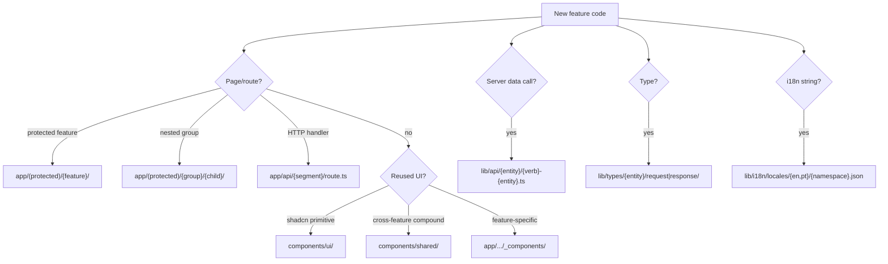

# Project Structure

This is a **template**. `admin/users` and `admin/roles` are baked in — use them as reference only, do not scaffold new admin entities unless explicitly asked.

This skill covers **new app features** under `app/(protected)/`, e.g.:

- `app/(protected)/projects/`
- `app/(protected)/imports/bmecat/`
- `app/(protected)/imports/xml/`

Read `AGENTS.md` and `node_modules/next/dist/docs/` before writing Next.js code.

## Stack

Next.js 16 · React 19 · shadcn/ui · better-auth + Keycloak · Prisma (auth only) · external .NET API via `lib/api/client.ts` · next-i18next · Zod + react-hook-form · TanStack Table · pnpm

## Where to put new code



## Route patterns for new features

All new features live under `app/(protected)/` and inherit session guard, sidebar, and breadcrumbs from the layout.

| Pattern       | Example                           | Files                                                                |
| ------------- | --------------------------------- | -------------------------------------------------------------------- |
| Single page   | `/projects`                       | `projects/page.tsx` + optional `loading.tsx`                         |
| Nested group  | `/imports/bmecat`, `/imports/xml` | `imports/bmecat/page.tsx`, shared `imports/layout.tsx` optional      |
| List + table  | `/projects` with datatable        | `page.tsx` + `_components/table-wrapper.tsx`, columns, actions       |
| Detail + tabs | `/projects/[id]/overview`         | `[id]/layout.tsx`, `[id]/page.tsx` → redirect, `[id]/{tab}/page.tsx` |
| Client-heavy  | upload wizards, live forms        | `_components/` with `'use client'` wrappers                          |

**Do not** put new features under `admin/` unless they are admin concerns. `admin/` is reserved for template CRUD (users, roles).

## App Router conventions

Per route segment:

- `page.tsx` — server component by default
- `loading.tsx` — co-located skeleton (preferred)
- `layout.tsx` — shared shell for nested segments (e.g. `imports/layout.tsx`)
- `_components/` — feature-local UI (Next private folder)

Route-local UI stays in `app/.../_components/`. Do not put feature code in `components/` unless reused across 2+ features.

## Sidebar nav

Register navigable features in `components/sidebar/nav-main.data.ts`:

```ts
{
  titleKey: 'breadcrumbs:projects',
  url: '/projects',
  icon: FolderIcon,
}
```

Nested groups use `titleKey` on the group + child routes:

```ts
{
  titleKey: 'breadcrumbs:imports',
  routes: [
    { titleKey: 'breadcrumbs:bmecat', url: '/imports/bmecat', icon: FileIcon },
    { titleKey: 'breadcrumbs:xml', url: '/imports/xml', icon: FileCodeIcon },
  ],
}
```

Add matching keys to `lib/i18n/locales/en/breadcrumbs.json` and `pt/breadcrumbs.json`.

## Breadcrumbs

Breadcrumbs render via parallel route `@breadcrumbs` in the protected layout header.

### Static

For routes where labels come from URL segments only — `/projects`, `/imports/bmecat`, `/imports/xml`.

**Steps:**

1. Add i18n keys in `breadcrumbs.json` (`en` + `pt`)
2. Register each URL segment in `BREADCRUMB_SEGMENT_KEYS` in `components/breadcrumbs/build-static-items.ts`
3. If a segment is a parent label only (not clickable), add to `LABEL_ONLY_SEGMENTS` (like `imports` grouping children)
4. No slot page needed — `@breadcrumbs/[...catchAll]/page.tsx` handles it

**Example `/imports/bmecat`:** Imports (text) → BMECat (current)

### Dynamic `[id]` (detail pages with fetched name)

For routes like `/projects/42/overview` where breadcrumb needs API data.

**Steps:**

1. Create `components/breadcrumbs/{feature}-detail-breadcrumb.tsx` — fetch entity, build `BreadcrumbItem[]`, return `<Breadcrumbs />`
2. Export from `components/breadcrumbs/index.ts`
3. Create slot page `app/(protected)/@breadcrumbs/{feature}/[id]/[tab]/page.tsx`
4. Map tab slugs to i18n keys inside the breadcrumb component
5. If `[id]/page.tsx` redirects to a tab, add redirect pattern to `components/breadcrumbs/redirect-routes.ts`

See [reference.md](reference.md) for full breadcrumb walkthrough and code.

### BreadcrumbItem shape

```ts
type BreadcrumbItem = { label: string; href?: string };
```

Last item = current page (no `href`). Parent labels without `href` render as plain text.

## Component layers

| Layer         | Path                                             | Use when                                        |
| ------------- | ------------------------------------------------ | ----------------------------------------------- |
| UI            | `components/ui/`                                 | shadcn primitives — no business logic           |
| Shared        | `components/shared/`                             | `Page`, `Details`, `DataTable`, `Form`, `Table` |
| Shell         | `components/sidebar/`, `components/breadcrumbs/` | Navigation chrome                               |
| Feature-local | `app/(protected)/.../_components/`               | Tables, modals, forms, upload UI                |

- Pages: compound `Page` from `components/shared/pages-layout`
- Detail views: compound `Details` from `components/shared/details`
- Promote to `shared/` only when reused across features

## lib/ patterns

### Server actions (`lib/api/{entity}/`)

- One `'use server'` file per operation, default export
- `camelCase` verb-first (`getProjects`, `importBmecat`)
- Use `api` helper from `lib/api/utils.ts`
- Mutating calls: `revalidatePath()` after success

### Types (`lib/types/{entity}/`)

- `request/` + `response/` subfolders
- Shared pagination: `lib/types/list-query.ts`, `lib/types/cursor-paginated-list.ts`

### Mock data

`lib/test-data/{domain}.ts` until real API exists.

## New feature checklist

### Single or nested page

1. `app/(protected)/{feature}/page.tsx` — `getT()`, `Page` compound
2. Optional `loading.tsx`, optional `layout.tsx` for groups
3. i18n namespace in `en` + `pt`; register in `i18n.config.ts`
4. Sidebar entry in `nav-main.data.ts`
5. Breadcrumb keys in `breadcrumbs.json` + `BREADCRUMB_SEGMENT_KEYS`

### Feature with list + detail

1. List page + `_components/` (table-wrapper, columns, actions) — mirror pattern from `admin/users` list, but under your feature path
2. `[id]/layout.tsx` fetches entity, `[id]/page.tsx` redirects to default tab
3. `lib/api/{entity}/`, `lib/types/{entity}/`, i18n namespace
4. Dynamic breadcrumb component + `@breadcrumbs/{feature}/[id]/[tab]/page.tsx`

### Client-heavy feature (imports, wizards)

1. Server `page.tsx` shell with `Page` compound
2. `'use client'` components in `_components/` for interactivity
3. Server actions in `lib/api/` for API calls; forms use Zod + `Form`/`ModalForm`

## Naming

| Element       | Convention                  | Example                           |
| ------------- | --------------------------- | --------------------------------- |
| Files/folders | `kebab-case`                | `import-bmecat-form.tsx`          |
| Components    | `PascalCase`                | `ImportBmecatForm`                |
| API functions | `camelCase`, default export | `getProjects`, `importBmecat`     |
| Types         | `PascalCase` + suffix       | `ImportBmecatRequest`             |
| Imports       | `@/` alias always           | `@/lib/api/projects/get-projects` |

## Do / Don't

**Do**

- Put new features at `app/(protected)/{feature}/`
- Server pages with `getT()`; client only for interactivity
- Co-located `loading.tsx` per segment
- Register i18n in `i18n.config.ts` + `en`/`pt` files
- Look at `admin/users` or `dashboard` for patterns — don't copy admin path

**Don't**

- Recreate or extend `admin/` unless explicitly asked
- Put feature UI in `components/` — use `_components/`
- Business logic in `components/ui/`
- Prisma for business data (API only)
- Put .NET API calls in `app/api/` route handlers

## Reference

Full tree, scaffolds, breadcrumb examples, and code samples: [reference.md](reference.md).
