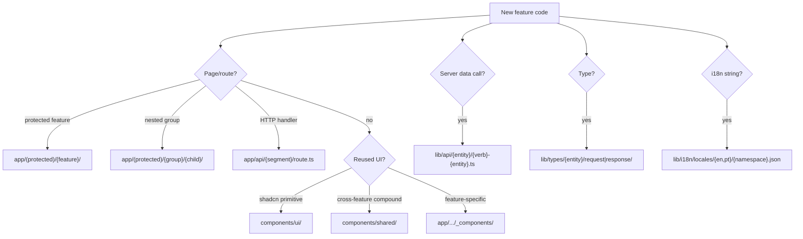

# Project Structure

This is a **template**. `admin/users` and `admin/roles` are baked in — use them as reference only, do not scaffold new admin entities unless explicitly asked.

This skill covers **new app features** under `app/(protected)/`, e.g.:

- `app/(protected)/projects/`
- `app/(protected)/imports/bmecat/`
- `app/(protected)/imports/xml/`

Read `AGENTS.md` and `node_modules/next/dist/docs/` before writing Next.js code.

## Stack

Next.js 16 · React 19 · shadcn/ui · better-auth + Keycloak · Prisma (auth only) · external .NET API via `lib/api/client.ts` · next-i18next · Zod + react-hook-form · TanStack Table · pnpm

## Where to put new code

## Route patterns for new features

All new features live under `app/(protected)/` and inherit session guard, sidebar, and breadcrumbs from the layout.

| Pattern       | Example                           | Files                                                                |
| ------------- | --------------------------------- | -------------------------------------------------------------------- |
| Single page   | `/projects`                       | `projects/page.tsx` + optional `loading.tsx`                         |
| Nested group  | `/imports/bmecat`, `/imports/xml` | `imports/bmecat/page.tsx`, shared `imports/layout.tsx` optional      |
| List + table  | `/projects` with datatable        | `page.tsx` + `_components/table-wrapper.tsx`, columns, actions       |
| Detail + tabs | `/projects/[id]/overview`         | `[id]/layout.tsx`, `[id]/page.tsx` → redirect, `[id]/{tab}/page.tsx` |
| Client-heavy  | upload wizards, live forms        | `_components/` with `'use client'` wrappers                          |

**Do not** put new features under `admin/` unless they are admin concerns. `admin/` is reserved for template CRUD (users, roles).
